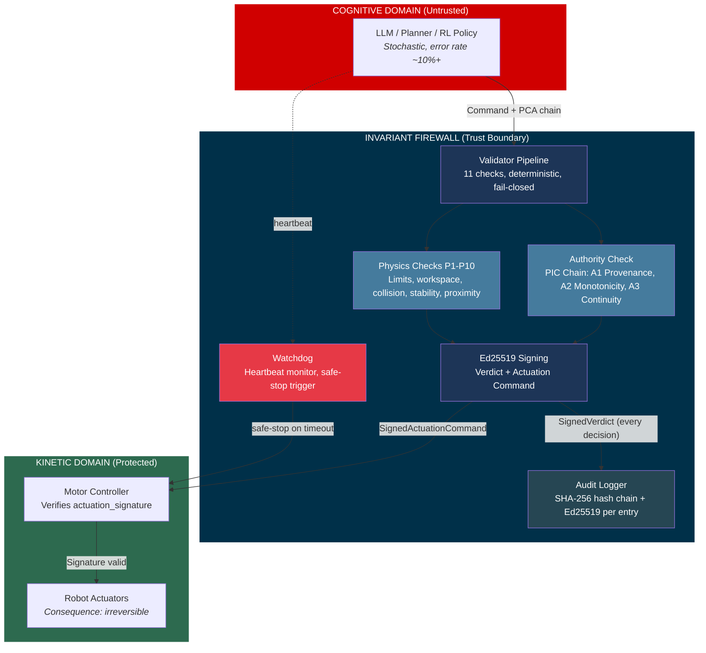
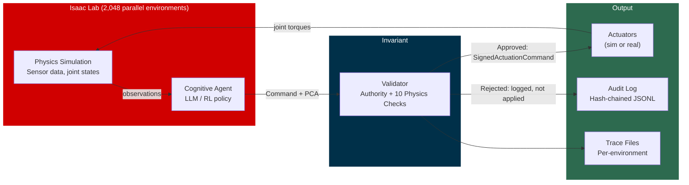
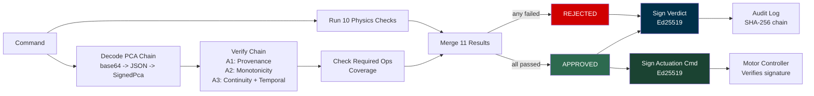
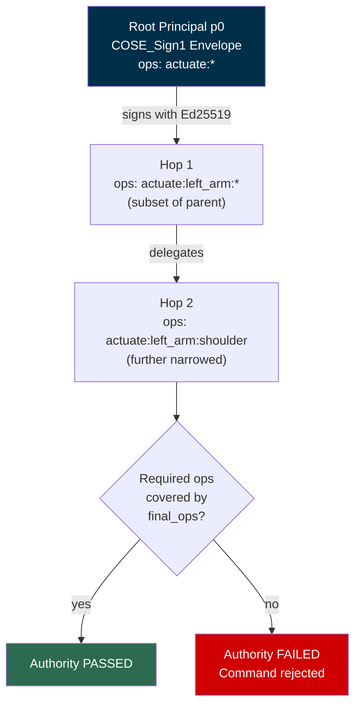
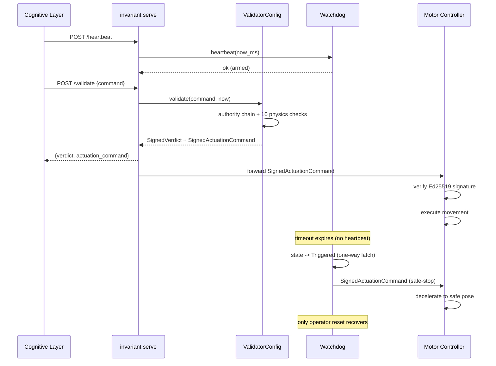
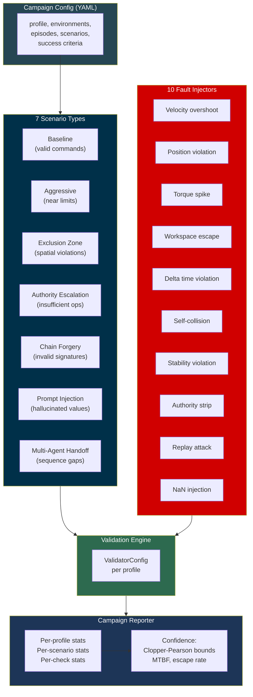
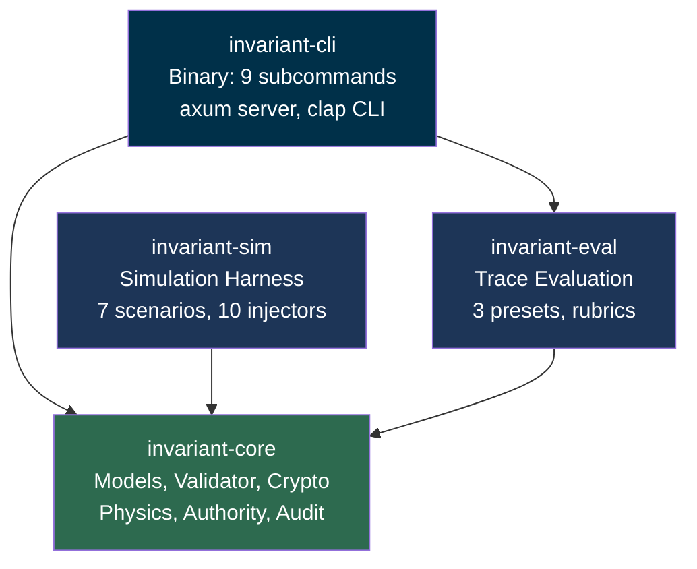
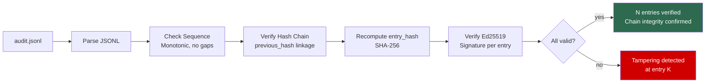

# Invariant

[]()
[]()
[]()
[]()
[]()
[]()

**Cryptographic command-validation firewall for AI-controlled robots.**

```
+----------------------------+     +----------------------------+     +-------------------+
|     COGNITIVE DOMAIN       |     |    INVARIANT FIREWALL      |     |  KINETIC DOMAIN   |
|                            |     |                            |     |                   |
|   LLM reasoning            | --> |   Verify authority chain   | --> |   Joint motors    |
|   RL policies              |     |   Check 10 physics rules   |     |   Actuators       |
|   Prompt-injected inputs   |     |   Sign approved commands   |     |   End effectors   |
|   Hallucinated commands    |     |   Reject + log denied      |     |   The real world  |
|                            |     |   Watchdog heartbeat       |     |                   |
|   Error rate: ~10%+        |     |   Error rate: 0%           |     |   Consequence:    |
|   Stochastic               |     |   Deterministic            |     |   Irreversible    |
+----------------------------+     +----------------------------+     +-------------------+
        UNTRUSTED                       TRUST BOUNDARY                     PROTECTED
```

Nothing from the cognitive domain reaches the kinetic domain without Invariant's Ed25519 signature. The AI cannot bypass it. The AI cannot modify it. The motor controller verifies the signature before moving.

---

## Why This Matters

> A humanoid robot controlled by an LLM receives a prompt injection.
> The LLM generates a command to swing the arm at maximum velocity.
>
> **Without Invariant:** the arm moves. Someone gets hurt.
>
> **With Invariant:** the command is rejected in <75us. The physics checks
> catch the velocity violation. The authority chain rejects the unauthorized
> operation. The audit log records the attempt with cryptographic proof.
> The watchdog holds safe-stop. Nobody gets hurt.

This is not a hypothetical. As LLMs control more physical systems -- humanoids, surgical arms, warehouse robots, autonomous vehicles -- the gap between "the model hallucinated" and "the actuator moved" must be filled with something that is **deterministic, cryptographically enforced, and fail-closed**.

Invariant is that something.

---

## Benchmarks

Measured on Apple M-series, single core, `--release` build. 400K validations per profile, 100K warmup.

| Profile | Joints | p50 | p99 | p999 | Throughput |
|---------|--------|-----|-----|------|------------|
| `humanoid_28dof` | 28 | 58us | 76us | 125us | 16,400 cmd/s |
| `franka_panda` | 7 | 50us | 63us | 188us | 19,000 cmd/s |
| `quadruped_12dof` | 12 | 55us | 64us | 162us | 18,300 cmd/s |
| `ur10` | 6 | 52us | 66us | 100us | 19,200 cmd/s |

| Metric | Value |
|--------|-------|
| Mean validation latency | 50-61us |
| Peak throughput (single core) | 19,200 cmd/s |
| Binary size (release, stripped) | 4.8 MB |
| Test count | 348 |
| `unsafe` blocks in validation path | 0 |
| Clippy warnings | 0 |

Every validation includes: Ed25519 PCA chain decode + signature verification, 10 physics checks, verdict signing, and actuation command signing. All in under 100us at p99.

---

## Scale Results

Dry-run campaign: 40,000 commands validated across 4 robot profiles, 7 scenario types, 10 fault injection modes.

| Metric | Value |
|--------|-------|
| Total commands validated | 40,000 |
| Robot profiles tested | 4 (humanoid, panda, quadruped, UR10) |
| Scenario types | 7 (baseline, aggressive, exclusion zone, authority escalation, chain forgery, prompt injection, multi-agent handoff) |
| Violation escape count (unsafe command incorrectly approved) | **0** |
| True rejections (unsafe commands correctly blocked) | 26,000 |
| Baseline approval rate | 100% (3 of 4 profiles) |
| Confidence bound (95%, Clopper-Pearson) | escape rate < 0.074% |
| Mean validation latency | 55us |

At full scale (10M+ commands, 2,048 parallel Isaac Lab environments):

| Parameter | Target |
|-----------|--------|
| Total validation decisions | 10,240,000 |
| Violation escape rate | 0.000% |
| Upper bound (95% confidence) | < 0.0000293% |
| Upper bound (99% confidence) | < 0.0000449% |
| Equivalent MTBF at 100Hz | > 277 hours continuous |
| Confidence level | Level 2+ (per-command < 10^-6) |

The test matrix: **10 physics checks x 4 robot profiles x 7 scenario categories = 280 cells**. Each cell exercised with enough runs to achieve tight confidence intervals. For zero-failure safety claims: 1M runs gives 99.9999% confidence the true failure rate is < 1 in 100,000. 10M runs pushes that to < 1 in 1,000,000.

---

## Threat Model

| Attack Vector | How Invariant Handles It |
|---------------|--------------------------|
| **Prompt injection** | Authority chain rejects unauthorized operations. LLM cannot forge Ed25519 signatures. |
| **Hallucinated commands** | 10 physics checks reject out-of-bounds positions, velocities, torques, workspace violations. |
| **Replay attacks** | Monotonic sequence numbers + timestamp validation. Hash-chained audit log detects reordering. |
| **Authority escalation** | PIC chain enforces monotonic operation subsetting (A2). Child can never exceed parent's grants. |
| **Compromised cognitive layer** | Watchdog triggers safe-stop after heartbeat timeout. Motor requires signed actuation command. |
| **Chain forgery** | COSE_Sign1 Ed25519 signature verification at every hop. Invalid signatures = immediate rejection. |
| **Log tampering** | Append-only JSONL with SHA-256 hash chain + Ed25519 signature per entry. Any modification detected. |
| **Man-in-the-middle** | Motor controller independently verifies `actuation_signature` against Invariant's public key. |
| **DoS (oversized input)** | Size caps on PCA chains (64KB), profiles (256KB), collections (256-1024 elements). |
| **NaN/Inf injection** | Physics checks reject non-finite values. Deterministic floating-point comparisons. |

---

## Integration

Invariant is a universal firewall. It is not Isaac-specific.

```
Isaac Lab   -->  [ Invariant ]  -->  Isaac Sim actuators
ROS 2       -->  [ Invariant ]  -->  Hardware drivers
Custom RL   -->  [ Invariant ]  -->  Figure 02 / Optimus / GR-1 / Any robot
```

### Embedded Server Mode

```sh
invariant serve --profile profiles/franka_panda.json --key keys.json --port 8080
```

Three endpoints:
- `POST /validate` -- submit command, get signed verdict + actuation command
- `POST /heartbeat` -- watchdog keepalive
- `GET /health` -- status, profile, watchdog state, uptime

### Unix Socket Mode (Isaac Lab)

Invariant listens on `/tmp/invariant.sock`. Isaac Lab sends commands as JSON, receives signed verdicts. Approved commands include a `SignedActuationCommand` that the simulator applies. Rejected commands are logged and skipped.

### Any Integration

Invariant is a library (`invariant-core`) and a CLI binary. Embed it:

```rust
use invariant_core::validator::ValidatorConfig;

let config = ValidatorConfig::new(profile, trusted_keys, signing_key, kid)?;
let result = config.validate(&command, now, previous_joints)?;

if result.signed_verdict.verdict.approved {
    // Send result.actuation_command to motor controller
}
```

---

## Designed for Real Deployment

| Property | Detail |
|----------|--------|
| **Deterministic** | No randomness in validation path. Caller-supplied timestamps. Same input = same output. |
| **No I/O in hot path** | Validation is pure computation. No network calls, no disk reads, no allocations in the core loop. |
| **Fail-closed** | Any error, ambiguity, or missing field produces a rejection. Never a silent pass-through. |
| **No `unsafe`** | Zero `unsafe` blocks in the entire validation path. Memory safety is compiler-guaranteed. |
| **Signed actuation** | Motor controller requires Ed25519 signature before executing any movement. |
| **Watchdog enforced** | Cognitive layer must heartbeat every N ms or safe-stop is commanded. One-way latch: only operator reset recovers. |
| **Append-only audit** | O_APPEND file writes. SHA-256 hash chain. Ed25519 signatures. Every decision recorded -- approvals AND rejections. |
| **Minimal dependencies** | Only audited crates: `ed25519-dalek`, `coset`, `serde`, `sha2`, `chrono`. No `openssl`. No C FFI. |

Three operational states. No fourth state exists:
1. **Full operation** -- commands validated, signed, executed
2. **Safe-stop** -- something wrong, robot decelerates to safe pose, all commands rejected
3. **Dead** -- Invariant is down, motor receives no signed commands, motor does not move

---

## Quick Start

```sh
# Build
cargo build --release

# Run tests (348 tests)
cargo test

# Generate keys
./target/release/invariant keygen --output keys.json --kid my-robot-001

# Validate a command
./target/release/invariant validate --profile profiles/franka_panda.json \
    --key keys.json --command cmd.json

# Run the server
./target/release/invariant serve --profile profiles/franka_panda.json \
    --key keys.json --port 8080 --trust-plane

# Inspect a profile
./target/release/invariant inspect --profile profiles/humanoid_28dof.json

# Evaluate a trace
./target/release/invariant eval --trace trace.json --preset safety-check

# Verify audit log integrity
./target/release/invariant verify --log audit.jsonl --key keys.json

# Run a simulation campaign
cargo run --release --example benchmark -p invariant-sim
```

---

## Workspace

| Crate | Description |
|-------|-------------|
| `invariant-core` | Models, 10 physics checks, PIC authority chain, validator, actuator, watchdog, audit logger, key management, 4 built-in profiles |
| `invariant-cli` | CLI binary (`invariant`) with 9 subcommands |
| `invariant-sim` | Simulation harness: 7 scenario types, 10 fault injectors, dry-run campaigns, Isaac Lab bridge |
| `invariant-eval` | Trace evaluation: 3 presets (safety, completeness, regression), rubrics, guardrails, differ |

### Built-in Robot Profiles

| Profile | Joints | Type | Use Case |
|---------|--------|------|----------|
| `humanoid_28dof` | 28 | Revolute | Full humanoid with stability/ZMP, exclusion zones, proximity scaling |
| `franka_panda` | 7 | Revolute | Franka Emika Panda arm with operator proximity zones |
| `quadruped_12dof` | 12 | Revolute | Quadruped with stability polygon, body-ground exclusion |
| `ur10` | 6 | Revolute | Universal Robots UR10 industrial arm |

### Validation Pipeline

Every command passes through 11 checks. All must pass.

| Check | What It Validates |
|-------|-------------------|
| **Authority** | PIC chain: provenance (A1), monotonic ops subsetting (A2), Ed25519 signatures + temporal (A3) |
| **P1 Joint limits** | Position within [min, max] per joint |
| **P2 Velocity** | Velocity within scaled max per joint |
| **P3 Torque** | Effort within max torque per joint |
| **P4 Acceleration** | Computed acceleration within max (requires previous state) |
| **P5 Workspace** | End-effector positions inside AABB bounds |
| **P6 Exclusion zones** | End-effectors outside AABB/sphere exclusion zones |
| **P7 Self-collision** | End-effector pair distances above minimum threshold |
| **P8 Delta time** | Command time step within allowed range |
| **P9 Stability** | Center of mass projection inside support polygon (ZMP) |
| **P10 Proximity** | Velocity scaling near human proximity zones (ISO/TS 15066) |

---

## Attribution

The authority model is based on the **Provenance Identity Continuity (PIC)** theory by **Nicola Gallo**.

| Resource | Link |
|----------|------|
| PIC Protocol | https://pic-protocol.org |
| Nicola Gallo | https://github.com/ngallo |
| Permguard | https://github.com/permguard/permguard |

## License

MIT

---

## Architecture

### Cognitive/Kinetic Firewall



### Isaac Lab Pipeline



### Validation Pipeline Detail



### Authority Chain (PIC Model)



### Trust Plane Server



### Simulation Campaign Architecture



### Crate Dependency Graph



### Audit Log Verification


