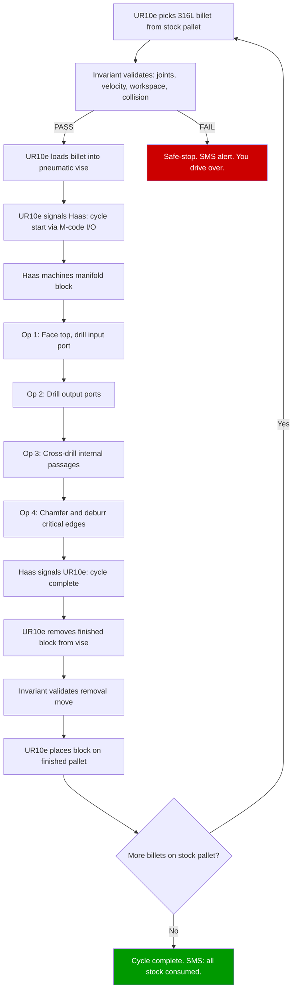
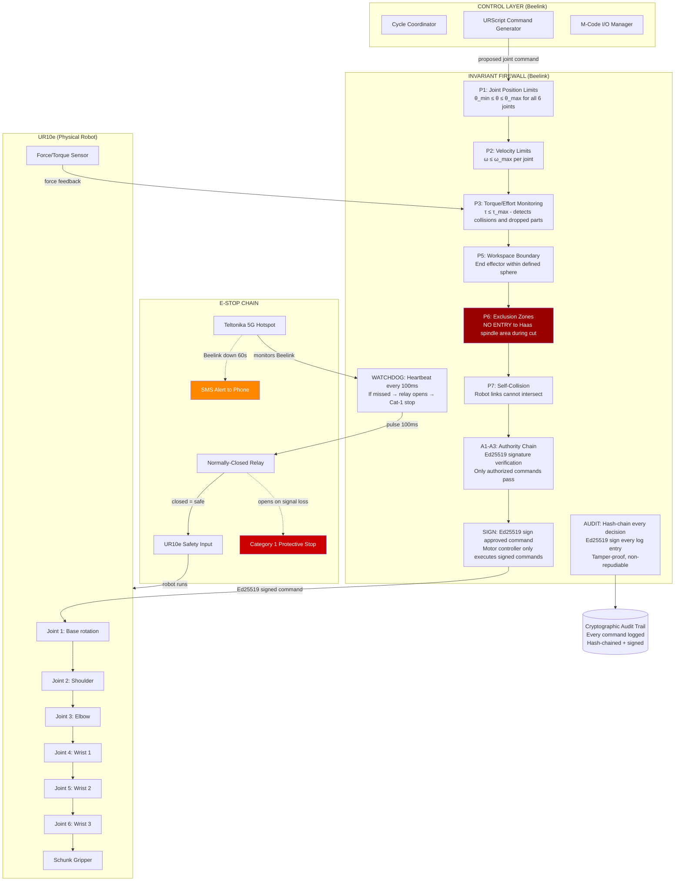
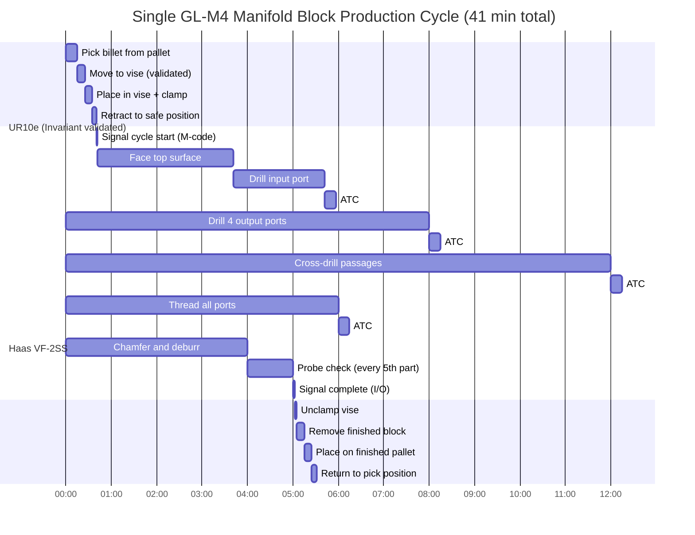
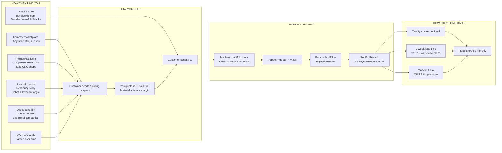
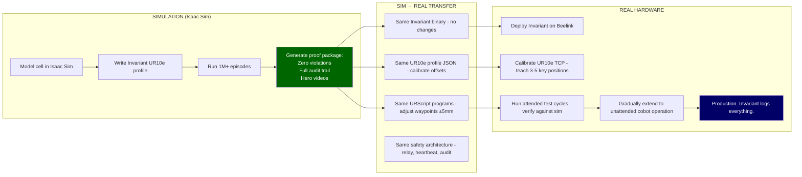

# Good Luck LLC — Business Plan

**Author:** Clay Good
**Date:** April 2026
**Location:** Industrial bay, Tea / South Sioux Falls, SD (10 min from 5120 S Rolling Green Ave)
**Entity:** Good Luck LLC (via Northwest Registered Agent, SD)
**Horizon:** 55–65 year marathon. Prove each phase before committing to the next.

---

## 1. Mission

Manufacture precision 316L stainless steel manifold blocks for the US gas delivery and semiconductor supply chain using a Haas VF-2 CNC mill and UR10e cobot, validated by Invariant safety software, operated by one person spending 2–3 hours/day on-site.

One product family. One machine. One robot. Mass produce. Reinvest everything.

### 1.1 The Three-Layer Business Model

| Layer | What | Revenue Source | Timeline |
|-------|------|---------------|----------|
| **Layer 1: Manufacturing** | Make 316L manifold blocks for CHIPS Act demand + 6061 aluminum automotive manifolds through BG sales connection | Part sales | Day 1 |
| **Layer 2: Software** | Develop and prove Invariant on your own real hardware — every production cycle generates safety data | Portfolio / career / IP | Day 1 (parallel) |
| **Layer 3: Product** | Sell the Beelink pre-loaded with Invariant as a safety appliance to other machinists who want cobot-tended CNC cells | Hardware + software product ($2K-$5K/unit) | Year 2-3 |

**This is the Amazon AWS model.** Amazon built AWS for themselves first, then sold it. You build Invariant for your own shop first, prove it works with 1M+ real-world validated decisions, then sell it to other shops. Your shop IS your reference customer. Your audit trail IS your proof.

---

## 2. The Products

### 2.1 What It Is

A manifold block is a machined metal block with internal passages, ports, and sealing surfaces that distributes gas or fluid from one input to multiple outputs. They are used in every semiconductor fab, every gas delivery system, every chemical processing plant, and every specialty gas panel in the world.

```
        GAS IN
          │
    ┌─────▼─────┐
    │           │
    │  316L SS  │ ← CNC machined from solid billet
    │  MANIFOLD │ ← Internal cross-drilled passages
    │  BLOCK    │ ← VCR or face-seal ports
    │           │
    └─┬──┬──┬──┘
      │  │  │
      ▼  ▼  ▼
    OUT OUT OUT
    (to valves, regulators, or process tools)
```

### 2.2 Why This Product Wins

| Factor | Why It's THE Product |
|--------|---------------------|
| **Demand** | The CHIPS Act is pouring $52B into US semiconductor fabs. Every new fab needs thousands of gas delivery components. Supply chains cannot keep up. |
| **Sells itself** | Semiconductor equipment companies, gas panel integrators, and specialty gas distributors are actively searching for domestic CNC shops that can machine 316L. You don't chase them — they're chasing capacity. |
| **Margin** | $200–$800 per block. Material cost: $15–$60 (316L billet). Gross margin: 80–90%. |
| **No certification to START** | Sell to gas panel integrators, specialty gas companies, equipment OEMs, research labs, and MRO operations. They need MTRs + dimensional inspection reports. NOT full SEMI compliance. |
| **Clear compliance path** | ISO 9001 in year 1–2 ($10K) opens 50% more customers. SEMI F20 compliance in year 2–3 opens direct fab sales. Each cert is a revenue multiplier, not a gate. |
| **Helps US economy** | Reshoring semiconductor supply chain is a national priority. You are literally building critical infrastructure. |
| **Perfect for Haas VF-2** | Multi-port manifolds with cross-drilled passages are exactly what a 3-axis vertical mill does best. This is the machine's sweet spot. |
| **Perfect for cobot** | Every block is the same billet blank. Same program, same robot cycle, same vise position. Load, run, unload, repeat. |
| **Tests Invariant** | The UR10e operates near a 12,000 RPM spindle with 30HP. Workspace exclusion, authority validation, and watchdog heartbeat are genuinely safety-critical — not academic exercises. |
| **Ships via FedEx** | A typical manifold block is 4–6 lbs. Fits in a small FedEx box. |
| **One material mastery** | 316L stainless for everything. Master one material's feeds, speeds, and tooling. |

### 2.3 Specific Product Family (Start Small, Expand)

Start with 3 standard manifold block sizes. Make a few of each. List them. Sell them. Only produce more when orders come in. Expand the family based on what customers actually buy.

| SKU | Description | Ports | Dimensions | Price | Material | Cycle Time |
|-----|-------------|-------|-----------|-------|----------|-----------|
| GL-M2 | 2-port manifold block | 2 output + 1 input | 3" x 2" x 1.5" | $200 | $15 | 20 min |
| GL-M4 | 4-port manifold block | 4 output + 1 input | 5" x 3" x 2" | $450 | $35 | 40 min |
| GL-M6 | 6-port manifold block | 6 output + 1 input | 7" x 3" x 2" | $650 | $50 | 55 min |
| CUSTOM | Custom manifold (per drawing) | Any | Any within VF-2 envelope | $300–$1,200 | Varies | Varies |

**Start with GL-M2 and GL-M4.** These cover 80% of applications. The GL-M6 and custom work come later.

### 2.4 Who Buys These (No Certification Needed)

| Customer Type | Examples | What They Need From You | Volume |
|---------------|---------|------------------------|--------|
| Gas panel integrators | Regional gas panel builders, clean room equipment installers | MTR + dimensional report | 10–50/month per customer |
| Specialty gas companies | Regional gas distributors, calibration gas suppliers | MTR + dimensional report | 5–20/month |
| Semiconductor equipment OEMs (Tier 2–3) | Smaller companies that build sub-assemblies for Applied Materials, Lam, etc. | MTR + inspection + quality records | 20–100/month |
| Research labs & universities | National labs, university clean rooms | MTR + dimensional report | 1–10/month |
| Chemical processing | Chemical plants, water treatment, pharmaceutical | MTR + pressure test cert | 5–20/month |
| MRO (maintenance/repair) | Fab maintenance teams replacing worn manifolds | Fast turnaround + MTR | 2–10/month (urgent, premium pricing) |

**You provide with every part:**
1. Material Test Report (MTR) from the 316L supplier (comes with the raw material)
2. Dimensional inspection report (your measurements, calipers + micrometer)
3. Surface finish measurement (Ra value)
4. Helium leak test report (if customer requires — outsource initially, ~$50/part)

### 2.5 How You Sell

| Channel | What | When |
|---------|------|------|
| **Xometry** | Accept 316L RFQs. Build reputation and reviews. | Day 1 |
| **Direct outreach** | Email/call 30 gas panel integrators and specialty gas companies: "We machine custom 316L manifold blocks domestically. 2-week lead time." | Month 1 |
| **Shopify** | Simple product page for standard GL-M2/M4/M6 blocks. "316L Stainless Steel Gas Manifold Blocks — Made in USA." | Month 2 |
| **LinkedIn** | Post about your shop. "Solo operator + cobot manufacturing 316L manifolds for the US semiconductor supply chain." The reshoring story gets attention. | Month 1 |
| **Trade directories** | List on ThomasNet, MFG.com as a 316L CNC specialist. Companies search these for suppliers. | Month 2 |

### 2.6 The "Make a Few, Test Demand" Strategy

You're right — don't mass produce before validating demand. Here's the plan:

1. **Week 1–2:** Machine 5 each of GL-M2 and GL-M4. Take professional photos.
2. **Week 3:** List on Shopify. Email 30 potential customers with photos + specs.
3. **Week 4–8:** See what happens. Track inquiries, orders, questions.
4. **If orders come in:** Scale production. Load the cobot. Run evenings.
5. **If no orders:** Adjust. Different sizes? Different ports? Different market? The machine and robot don't care — reprogram and try again. Your capital investment is the same either way.

This costs you ~$500 in material to test. Not $50K in inventory.

### 2.7 What NOT to Make

| Product | Why Not |
|---------|---------|
| Spinal fusion screws | ISO 13485 + FDA 510(k) + biocompatibility testing = $200K–$500K in regulatory costs. Titanium (not 316L). Federal crime to sell unapproved medical devices. Not viable for a solo operator. |
| Aerospace fuel unions | AS9100 + ITAR registration. Possible in year 3+ with certs. Not now. |
| Dental implants | Same as spinal screws. ISO 13485 + FDA. |
| UHP manifolds for fabs (direct) | Requires SEMI F20/F19 + ISO 9001 + vendor qualification. Year 2–3 goal, not day 1. |

### 2.8 Compliance Roadmap (Earn More Over Time)

| Timeline | Certification | Cost | Revenue Unlock |
|----------|--------------|------|---------------|
| Day 1 | None (MTR + inspection reports only) | $0 | Integrators, gas companies, labs, MRO |
| Year 1–2 | ISO 9001 | ~$10K | Tier 2–3 semiconductor OEMs, larger integrators |
| Year 2–3 | SEMI F20 surface finish capability | ~$5K (outsource electropolish) | Semiconductor-adjacent customers |
| Year 3–5 | Full SEMI compliance + direct fab qualification | ~$15K | Direct sales to TSMC, Intel, Samsung fabs |
| Year 5+ | AS9100 (if pursuing aerospace) | ~$15K | Aerospace fuel unions, Tier 2 defense |

**Each certification is a revenue multiplier.** You don't need them all to start. You add them as the business earns the revenue to fund them.

### 2.9 Secondary Product Line: Automotive Billet Aluminum Manifolds

**Sales connection:** Your friend at BG Products (Director of Sales, Brighton, MI — the heart of the US automotive industry) provides a direct sales channel into the performance automotive aftermarket.

**The product:** Billet 6061-T6 aluminum performance fluid manifold blocks. Same geometry and machining expertise as 316L gas manifolds, but in aluminum — 5x faster to machine, broader market, higher volume.

| Product | Material | Price | Mat. Cost | Cycle Time | Margin | Sales Channel |
|---------|----------|-------|-----------|-----------|--------|--------------|
| AN Fitting Distribution Block (4-port) | 6061-T6 | $80-$120 | $5-$8 | 12-18 min | 85-90% | BG sales network → performance shops, engine builders |
| Oil Cooler Manifold Block | 6061-T6 | $100-$180 | $8-$12 | 15-25 min | 85-90% | BG network → race shops, dealership performance depts |
| Coolant Crossover Manifold | 6061-T6 | $120-$200 | $10-$15 | 18-30 min | 85-90% | BG network → engine builders, hot rod shops |
| Turbo Oil Feed/Drain Block | 7075-T6 | $60-$100 | $4-$6 | 10-15 min | 88-92% | BG network → turbo shops, performance distributors |

**Why this complements your primary product:**
- Same core competency (manifold machining)
- Aluminum machines 5x faster than 316L → fill downtime between 316L orders
- BG friend handles sales (you don't have to cold-call)
- Brighton, MI connections reach Summit Racing, Jegs, performance distributors
- Different market = diversified revenue (not 100% dependent on semiconductor cycle)
- Ships via FedEx in small boxes

**Strategy:** 316L manifold blocks are the PRIMARY product (higher margin, CHIPS Act demand). Automotive aluminum manifolds are SECONDARY — run them when the Haas would otherwise be idle, or during evening cobot shifts when you're filling automotive orders alongside 316L.

### 2.10 Layer 3: The Invariant Safety Appliance (Year 2-3)

Once you've proven Invariant on your own cell with 1M+ validated production cycles and zero safety incidents:

**The product:** A Beelink Mini PC pre-loaded with Invariant, pre-configured with safety profiles for common CNC + cobot setups, sold to other machinists who want to add cobot tending to their shops.

| Spec | Value |
|------|-------|
| Hardware | Beelink Mini PC + UPS + NEMA enclosure + relay module |
| Software | Invariant binary + UR safety profiles + Haas I/O coordinator |
| Setup | Plug into UR cobot, wire relay to safety input, configure via web UI |
| Price | $2,000-$5,000 per unit (hardware $600 + software license + support) |
| Market | Every CNC shop adding cobot tending (~10,000+ shops in the US) |
| Proof | "This system has validated 1M+ production commands with zero safety escapes in my own shop." |

**You are your own customer #1.** Every day your shop runs is another day of proof. That proof IS the marketing.

---

## 3. The Equipment

### 3.1 The Cell

| Item | Cost | Notes |
|------|------|-------|
| Haas VF-2SS (used) | $55,000 | 12,000 RPM, 30HP. The workhorse. ~8,000 lbs. |
| UR10e cobot (used) | $35,000 | 12.5kg payload, 1300mm reach. Handles manifold blocks easily. |
| Beelink Mini PC | $600 | Runs Invariant binary ONLY. Coordinates cycle, validates safety. |
| Pneumatic vise (Kurt DL640) | $4,000 | Auto-clamp for cobot loading. |
| Schunk PGN-plus gripper | $2,500 | Parallel gripper for rectangular billets. |
| Teltonika 5G hotspot | $300 | Outbound heartbeat + SMS alerting. |
| Chip conveyor | $2,000 | 316L chips are stringy. Non-negotiable. |
| Coolant management system | $1,500 | Concentration monitoring for 316L. |
| Tool breakage detection (probe) | $800 | Critical for lights-out. Detects broken end mills. |
| Inspection kit (Mitutoyo) | $1,500 | Calipers, micrometers, surface roughness tester. |
| NEMA enclosure for Beelink | $250 | Oil/coolant protection. |
| UPS battery backup (Beelink) | $300 | Graceful safe-stop on power loss. |
| Relay module (heartbeat) | $50 | Normally-closed, wired to UR10e safety input. |
| Leveling/anchoring kit | $1,500 | Proper leveling = better finish on 316L. |
| Security cameras (2x WiFi) | $200 | Remote monitoring from home. |
| Fire suppression (CO2) | $500 | Insurance may require for unattended operation. |
| Workbench + shelving | $400 | Deburr, inspect, pack, ship. |
| Forklift rigger (move-in) | $5,000 | Move 8,000 lb Haas into bay. |

**Total equipment: ~$111,400**

### 3.2 What the Beelink Does and Does NOT Do

```
┌───────────────────┐  ┌──────────────────┐  ┌──────────────────┐  ┌──────────────┐
│                   │  │                  │  │                  │  │              │
│  YOUR LAPTOP      │  │  HAAS NGC        │  │  BEELINK         │  │  UR10e       │
│  (at home or bay) │  │  CONTROLLER      │  │  (Invariant)     │  │  CONTROLLER  │
│                   │  │                  │  │                  │  │              │
│  Fusion 360 CAD   │  │  Runs G-code     │  │  Safety firewall │  │  Runs        │
│  Fusion 360 CAM   │  │  Controls spindle│  │  Physics checks  │  │  URScript    │
│  Business ops     │  │  Controls axes   │  │  Authority chain │  │  Controls    │
│  Quoting          │  │  Controls ATC    │  │  Heartbeat/watch │  │  6 joints    │
│  Invoicing        │  │  I/O signals     │  │  Audit logging   │  │  + gripper   │
│                   │  │                  │  │  Cycle coord.    │  │              │
│  NOT real-time    │  │  INDEPENDENT     │  │  REAL-TIME       │  │  INDEPENDENT │
└───────────────────┘  └──────────────────┘  └──────────────────┘  └──────────────┘
                              │                      │                     │
                              │      M-code I/O      │     Validated       │
                              │◄────────────────────►│     commands        │
                              │  "cycle complete"    │────────────────────►│
                              │  "door clear"        │  Ed25519 signed     │
                              │                      │◄────────────────────│
                              │                      │  Force/torque       │
                              │                      │  feedback           │
```

The Beelink is lightweight: Invariant is a Rust binary doing integer math on joint angles/velocities and Ed25519 signatures. It doesn't need a GPU. It doesn't run the CNC. It doesn't run the robot controller. It validates and coordinates.

---

## 4. The Space

### 4.1 Requirements

| Requirement | Spec |
|-------------|------|
| Size | **1,500 sq ft** (fits 3 cells at full scale) |
| Power | 3-phase 480V, 200A+ service (expandable to 400A for 3 machines) |
| Floor | 6" reinforced concrete slab (each Haas is 8,000 lbs) |
| Door | 14' overhead door (Haas move-in) |
| Ceiling | 12'+ |
| Location | Within 10 min of 5120 S Rolling Green Ave |
| Zoning | Industrial (I-1 or equivalent) |
| Layout capacity | Cell #1 day 1 → Cell #2 year 2 → Cell #3 year 3 |

**Why 1,500 sq ft:** Each cell (Haas + UR10e + pallets) needs ~120 sq ft with access clearance. Three cells = 360 sq ft. Add workbench (60 sq ft), material storage (80 sq ft), shipping station (40 sq ft), aisle space (200 sq ft), and breathing room = ~740 sq ft of usable area. 1,500 sq ft gives comfortable room for 3 cells plus all support infrastructure, with space for a desk/office area.

| Config | Machines | Fits in 1,500 sq ft? |
|--------|---------|---------------------|
| Year 1: 1 cell + workbench + storage | 1 Haas + 1 UR10e | Yes — very spacious |
| Year 2: 2 cells + shared workbench | 2 Haas + 2 UR10e | Yes — comfortable |
| Year 3: 3 cells + shared workbench | 3 Haas + 3 UR10e | Yes — snug but works |

### 4.2 Multi-Machine Scaling (Year 2-3+)

A Haas VF-2 footprint with robot and access clearance needs ~10' x 12' (120 sq ft) per cell.

| Bay Size | Machines | Robots | Beelinks | Comfortable? |
|----------|---------|--------|----------|-------------|
| 800 sq ft | 1 | 1 | 1 | Yes — room for workbench + storage |
| 1,200 sq ft | 2 | 2 | 2 | Yes — comfortable with shared workbench |
| 1,500 sq ft | 2-3 | 2-3 | 2-3 | Yes — 3 cells + full workspace |
| 2,000 sq ft | 3 | 3 | 3 | Comfortable — room for expansion |

**Recommendation:** Start with 1,200 sq ft. Fits 2 cells comfortably. When you add machine #3, move to a 1,500-2,000 sq ft bay (or take the adjacent unit if available).

### 4.3 Multi-Beelink Hotspot Architecture

One Teltonika 5G hotspot serves ALL Beelinks. The hotspot is just the network pipe for remote SMS alerting — it is NOT part of the safety chain.

```
                    ┌───────────────────┐
                    │  TELTONIKA 5G     │
                    │  HOTSPOT          │
                    │  (1 per shop)     │
                    └─────┬─────┬───────┘
                          │     │
              ┌───────────┘     └───────────┐
              │                             │
    ┌─────────▼─────────┐       ┌───────────▼───────────┐
    │  BEELINK #1       │       │  BEELINK #2           │
    │  (Invariant)      │       │  (Invariant)          │
    │                   │       │                       │
    │  Heartbeat ──► Relay #1   │  Heartbeat ──► Relay #2
    │  Audit log        │       │  Audit log            │
    │  SMS alerting ─►  │       │  SMS alerting ─►      │
    └────────┬──────────┘       └────────┬──────────────┘
             │                           │
    ┌────────▼──────────┐       ┌────────▼──────────────┐
    │  UR10e #1         │       │  UR10e #2             │
    │  + Haas #1        │       │  + Haas #2            │
    └───────────────────┘       └───────────────────────┘
```

**Key safety principle:** The physical e-stop relay is PER MACHINE. Each Beelink has its own relay wired to its own UR10e safety input. If the hotspot dies, the relays still work — the robots keep running safely. You only lose remote SMS alerting until you check your cameras or visit the shop.

**If Beelink #1 crashes:** Relay #1 opens → UR10e #1 stops. Beelink #2 and UR10e #2 continue running unaffected. The hotspot sends you one SMS about Beelink #1.

### 4.4 Location: Tea / South Sioux Falls

| Factor | Assessment |
|--------|-----------|
| Industrial bays available | Yes — Landmark Industrial Park, Tea industrial parks, I-29 corridor |
| Typical rent (800–1,200 sq ft) | $1,200–$2,000/month |
| 3-phase power | Standard in industrial parks |
| Drive from home | ~10 min to Tea / south SF industrial areas |
| FedEx access | Multiple locations along 57th St and 41st St |
| No state income tax | South Dakota — every dollar of profit is yours (federal tax only) |

### 4.3 Cell Layout

```
┌──────────────────────────────────────────────────────────────┐
│              INDUSTRIAL BAY (~1,000 sq ft)                    │
│                                                              │
│  ┌──────────────────┐                                        │
│  │                  │   ┌───────────┐                        │
│  │   HAAS VF-2SS    │   │  UR10e    │                        │
│  │   (8,000 lbs)    │   │  on floor │                        │
│  │                  │   │  pedestal │  ┌────────┐ ┌────────┐ │
│  │  [ pneumatic  ]  │   │     O     │  │  RAW   │ │ DONE   │ │
│  │  [   vise     ]  │   │    /|\    │  │ STOCK  │ │ PARTS  │ │
│  │                  │   │    / \    │  │ PALLET │ │ PALLET │ │
│  │  [chip conveyor] │   └───────────┘  └────────┘ └────────┘ │
│  └──────────────────┘                                        │
│                                                              │
│  ┌──────────┐  ┌──────────────────────────────────────────┐  │
│  │ BEELINK  │  │  WORKBENCH                               │  │
│  │(Invariant│  │  - Deburr / inspect / measure            │  │
│  │+ UPS     │  │  - Pack FedEx boxes                      │  │
│  │+ relay)  │  │  - Material certs & inspection reports   │  │
│  └──────────┘  └──────────────────────────────────────────┘  │
│                                                              │
│  ┌────────┐  ┌───────────────┐  ┌─────────────────────────┐ │
│  │COOLANT │  │ MATERIAL      │  │ SHIPPING STATION        │ │
│  │SYSTEM  │  │ STORAGE       │  │ FedEx supplies, scale,  │ │
│  │        │  │ (316L billets)│  │ label printer           │ │
│  └────────┘  └───────────────┘  └─────────────────────────┘ │
│                                                              │
│                    ═══════════════                            │
│                    14' OVERHEAD DOOR                          │
└──────────────────────────────────────────────────────────────┘
```

---

## 5. Workflows

### 5.1 Making a GL-M4 Manifold Block (Step by Step)

**This is what you actually do to make one part:**

**At home (your laptop):**
1. Open Fusion 360. The GL-M4 model already exists.
2. CAM toolpaths already programmed. Post-process G-code for Haas.
3. Upload G-code to Haas via USB or network.

**At the shop (your 2–3 hours):**
1. Drive to shop (10 min).
2. Check overnight run: inspect finished parts from cobot's last batch.
3. Deburr parts (file edges, clean surfaces). 20–30 min for a batch.
4. Measure critical dimensions with calipers/micrometer. Log results.
5. Pack parts in FedEx boxes with MTR + inspection report. Label.
6. Load new 316L billets into the raw stock pallet (pre-cut to size).
7. Start the cobot cycle. Run 2–3 attended cycles to verify.
8. Leave. The cobot + Invariant run the rest.
9. FedEx picks up or you drop off on the way home (10 min).

**What happens while you're gone:**



### 5.2 Your Daily Schedule (Steady State, Year 2+)

| Time | Activity | Location |
|------|----------|----------|
| 7:00 AM | Check Invariant logs + camera feed on phone | Home |
| 7:30 AM | Drive to shop | Car (10 min) |
| 7:40 AM | Inspect overnight parts. Measure. Log. | Shop |
| 8:10 AM | Deburr batch. Pack FedEx boxes. | Shop |
| 8:40 AM | Load fresh 316L billets. Start cobot cycle. | Shop |
| 9:00 AM | Business ops: invoicing, emails, material orders | Shop (desk) or phone |
| 9:30 AM | Drop off FedEx packages on the way home | FedEx (5 min) |
| 9:45 AM | Done. Go to W2 job, work on Invariant, train, relax. | Home |
| 6:00 PM | Quick phone check: Invariant logs, camera. | Home |
| 10:00 PM | Quick phone check before bed. | Home |

**Total shop time: ~2 hours.** The cobot runs 14–18 hours/day while you live your life.

---

## 6. Financial Projections

### 6.1 Startup Costs

| Category | Cost |
|----------|------|
| Haas VF-2SS (used) | $55,000 |
| UR10e (used) | $35,000 |
| All other equipment (from Section 3.1) | $21,400 |
| First 3 months operating (rent + material + insurance) | $12,000 |
| LLC + legal + insurance setup | $1,500 |
| **Total to launch** | **~$125,000** |

**Financing:** Equipment loan ($90K–$110K, 5-year, ~7%) + savings for the rest. Monthly loan payment: ~$1,800–$2,200.

### 6.2 Revenue Math (Per-Part Economics)

**GL-M4 manifold block (the workhorse product):**

| Metric | Value |
|--------|-------|
| Sell price | $450 |
| Material cost (316L billet) | $35 |
| Tooling cost per part | $8 |
| Cycle time (Haas) | 40 min |
| Robot load/unload | 1 min |
| **Gross profit per part** | **$407 (90%)** |

**Daily production capacity:**
- 40 min cycle + 1 min load/unload = 41 min per part
- 16 productive hours/day (attended AM + cobot rest of day) = 960 min
- **23 parts/day at 100% utilization**
- **15 parts/day at 65% utilization** (realistic year 2)

### 6.3 Year-by-Year Projections

#### Year 1: Learning + Building Customers

| Metric | Value |
|--------|-------|
| Utilization | 40% (learning, programming, debugging, finding customers) |
| Parts/day | ~9 |
| Working days | 250 |
| Average price (mix of sizes) | $350 |
| **Revenue** | **$787,500** |
| Material (20%) | -$157,500 |
| Tooling (8%) | -$63,000 |
| Rent | -$21,600 |
| Utilities | -$7,200 |
| Insurance | -$6,000 |
| Loan payment | -$26,400 |
| Shipping | -$5,000 |
| Misc (coolant, consumables, maintenance) | -$10,000 |
| **Net profit (pre-tax)** | **~$491,000** |

Wait — let me be more honest. 40% utilization AND 9 parts/day assumes ALL production time makes sellable parts. In reality, year 1 includes:
- Scrap parts while learning (10–20% scrap rate initially)
- Time programming and testing (not producing sellable parts)
- Time without customers (machine sits idle)

**Revised honest Year 1:**

| Metric | Conservative | Optimistic |
|--------|-------------|-----------|
| Sellable parts/day (avg across year) | 4 | 8 |
| Working days | 250 | 250 |
| Average price | $350 | $350 |
| **Revenue** | **$350,000** | **$700,000** |
| Total costs | -$200,000 | -$280,000 |
| **Net profit** | **$150,000** | **$420,000** |

**The $200K profit target is achievable in year 1 if you can sell 5–6 manifold blocks per day at an average of $350 each.** That's 100–125 blocks/month to customers.

#### Year 2: Optimized

| Metric | Value |
|--------|-------|
| Sellable parts/day | 10–15 |
| Average price | $400 (more custom work, higher-value blocks) |
| Revenue | $1M–$1.5M |
| Costs | $350K–$550K |
| **Net profit** | **$450K–$950K** |
| Your salary | $75,000 |
| Self-employed 401k max | $23,500 |
| Reinvest in business | Everything else |

#### Year 3+: Scale Decision

- Add second machine (Haas VF-2 or horizontal mill for 2-side work)
- Add second UR10e
- ISO 9001 certified → semiconductor OEM customers
- Revenue: $1.5M–$3M
- Hire one machinist or keep fully automated

### 6.4 Why These Numbers Are Achievable

- A Haas VF-2 shop rate is $85–$125/hour
- At $100/hour and 16 hours/day x 250 days = $400,000/year of machine time
- At 60% utilization: $240,000 in machine time
- Your markup (material + profit) doubles that to $400K–$500K revenue
- Your costs are ~$200K
- **Profit: $200K–$300K**

The math works because: the machine runs while you're not there. That's the entire value proposition of the cobot + Invariant. You're selling 16 hours/day of machine time while only being present for 2–3 hours.

---

## 7. Invariant's Role

### 7.1 Why This Cell NEEDS Invariant

The Haas VF-2 is genuinely dangerous:
- 12,000 RPM spindle (30 HP)
- Rapid traverse at 1,000 inches per minute
- 8,000 lbs of machine
- Sharp 316L chips flying at high velocity
- Coolant spray

A UR10e reaching into this enclosure at the wrong time = destroyed robot arm + destroyed part + potential fire. This is not a toy.

**Invariant prevents:**
- The robot entering the workspace while the spindle is running (P6: exclusion zone)
- The robot exceeding safe velocity near the machine (P2: velocity limits)
- The robot applying excessive force on a part or fixture (P3: torque/effort)
- Any command not cryptographically authorized (A1–A3: authority chain)
- Software crash leaving the robot in an unsafe state (Watchdog: heartbeat)

Every cycle is logged with cryptographic signatures. After 12 months of production, you have:
- ~3,000+ validated robot cycles with full audit trails
- Zero safety incidents (or documented incidents that Invariant caught)
- Real-world proof that Invariant works on industrial hardware

**That data is your portfolio. That data is your product. That data is your career.**

### 7.2 E-Stop Architecture

```
  BEELINK ──heartbeat 100ms──► RELAY (NC) ──► UR10e SAFETY INPUT
                                                    │
                                            If relay opens:
                                            Cat-1 protective stop
                                            Joints lock
                                                    │
  TELTONIKA 5G ──watchdog──► BEELINK               │
       │                                            │
       └──Beelink down > 60s──► SMS to your phone   │
                                     │              │
                                You drive 10 min ───┘
```

---

## 8. Phased Execution

### Phase 0: Simulation + Business Setup (Now → Month 2)

**Cost: < $100 + your time**

- [ ] Model UR10e + Haas VF-2 cell in Isaac Sim
- [ ] Write Invariant profile for UR10e
- [ ] Run ~100K simulation campaign (adversarial, fault injection, collision)
- [ ] Design GL-M2 and GL-M4 manifold blocks in Fusion 360
- [ ] Program CAM toolpaths and post-process for Haas
- [ ] Form Good Luck LLC (Northwest Registered Agent)
- [ ] Open business bank account
- [ ] Contact Bender Commercial / Tea industrial parks for bay quotes

### Phase 1: Equipment + Setup (Month 2 → Month 5)

**Cost: ~$125K (equipment loan + savings)**

- [ ] Secure industrial bay (800–1,200 sq ft, 3-phase, 14' door)
- [ ] Purchase used Haas VF-2SS + used UR10e
- [ ] Hire rigger to move and level Haas
- [ ] Install pneumatic vise, chip conveyor, coolant system
- [ ] Mount UR10e, calibrate, wire safety relay to Beelink
- [ ] Deploy Invariant on Beelink
- [ ] Machine first GL-M2 manually. Dial in feeds/speeds for 316L.
- [ ] First cobot-tended cycle with Invariant monitoring

### Phase 2: First Revenue (Month 5 → Month 8)

**Cost: ~$5K (material + tooling)**

- [ ] Machine 5 each of GL-M2 and GL-M4. Take photos.
- [ ] List on Shopify, ThomasNet, MFG.com
- [ ] Sign up on Xometry as 316L specialist
- [ ] Email 30 gas panel integrators and specialty gas companies
- [ ] Sell first blocks. Ship via FedEx. Collect feedback.
- [ ] If orders come: scale production, extend cobot hours
- [ ] If no orders: adjust product specs, try different customers, keep Xometry as backfill

### Phase 3: Scale Production (Month 8 → Month 18)

**Gate: $20K+/month revenue**

- [ ] Cobot running 14–18 hours/day
- [ ] 5–10 manifold blocks/day shipping
- [ ] Your routine: 2–3 hours/day on-site
- [ ] Publish Invariant operational data (blog, GitHub, LinkedIn)
- [ ] Begin ISO 9001 process

### Phase 4: Certify + Expand (Year 2+)

**Gate: $250K+ annual revenue, stable operations**

- [ ] ISO 9001 certified ($10K)
- [ ] Quote semiconductor equipment OEMs directly
- [ ] Evaluate second machine
- [ ] Begin SEMI F20 capability development
- [ ] Self-employed 401k maxed at $23,500
- [ ] Reinvest remaining profit into business

### Phase 5+: The Long Game (Year 3–65)

- SEMI compliance → direct fab sales
- Second/third machine → $1M+ revenue
- License Invariant to other automated shops
- Invariant becomes a standard for robotic safety in manufacturing
- The shop is a profitable, automated business. Invariant is the legacy.

---

## 9. Risk Register

| Risk | Likelihood | Impact | Mitigation |
|------|-----------|--------|------------|
| Can't find customers for manifold blocks | Medium | High | Xometry backfill. Direct outreach to 30+ companies. The reshoring demand is real. |
| 316L harder to machine than expected | High | Medium | Budget 2x tooling. The Haas has the power for 316L — it's the right machine. Learn feeds/speeds early. |
| Cobot reliability lower than planned | Medium | Medium | Plan for 14 hrs/day, not 24. You check morning + evening. |
| Loan denied | Medium | High | Simulation proof package + business plan. SBA microloan as backup. Equipment leasing as alternative. |
| Revenue too low year 1 | Medium | Medium | Keep W2 job as long as needed. The shop runs while you work your day job. |
| Quality issues / scrap rate | High (early) | Medium | First 3 months are learning. Budget for scrap. Get first articles CMM inspected. |
| Chip evacuation / coolant issues | High | Medium | Chip conveyor is mandatory. High-pressure coolant through spindle helps. |
| Machine breakdown | Low-Med | High | Haas has excellent service network. Keep $5K emergency fund. |

---

## 10. Decision Checklist

Before spending money:

- [ ] Simulation campaign complete (100K+ episodes, zero safety violations)
- [ ] Good Luck LLC formed
- [ ] Business bank account open
- [ ] Industrial bay identified (3-phase, 14' door, 6" slab, near home)
- [ ] Equipment loan pre-approved or cash available
- [ ] Used Haas VF-2SS identified (inspected, service history verified)
- [ ] Used UR10e identified (joint condition verified)
- [ ] GL-M2 and GL-M4 designed and toolpathed in Fusion 360
- [ ] Insurance quoted (GL + equipment + product liability)
- [ ] 6 months operating expenses in reserve (~$25K)
- [ ] Invariant UR10e profile written, tested, validated in simulation
- [ ] 10 potential customers identified (names, contact info, what they need)

---

## 11. Your Life at Steady State (Year 2+)

| Time | Activity |
|------|----------|
| 6:00 AM | Wake up. Check Invariant logs on phone. All green. |
| 6:30 AM | Gym / train / run |
| 7:30 AM | Drive to shop (10 min) |
| 7:40 AM | Inspect overnight parts. Measure critical dims. |
| 8:10 AM | Deburr. Pack FedEx boxes. Load fresh billets. |
| 8:40 AM | Start cobot cycle. Quick business ops on laptop. |
| 9:30 AM | Drop FedEx on the way home. |
| 9:45 AM | Home. Work on Invariant code. Or go to W2 job. Or relax. |
| 6:00 PM | Phone check. Invariant logs. Camera feed. All good. |
| 10:00 PM | Phone check before bed. Cobot still running. |
| Overnight | Cobot makes manifold blocks. Invariant watches. You sleep. |

**This is the life you described: work, train, relax, sleep.**
**The cobot works the other 22 hours.**

---

---

## 12. Five-Year Financial Projection (Honest)

### 12.1 Year-by-Year Summary

| Year | Utilization | Blocks/Day | Avg Price | Revenue | Total Costs | Net Profit | Your Salary | 401k | Reinvest |
|------|-----------|-----------|----------|---------|------------|-----------|------------|------|---------|
| 1 | 35-45% | 4-6 | $350 | $350K-$525K | $200K-$250K | $100K-$275K | $75,000 | $23,500 | Rest |
| 2 | 55-65% | 8-12 | $400 | $700K-$1.2M | $300K-$450K | $400K-$750K | $75,000 | $23,500 | Rest |
| 3 | 65-75% | 10-15 | $425 | $1M-$1.6M | $400K-$600K | $600K-$1M | $100,000 | $23,500 | 2nd machine |
| 4 | 70-80% (2 machines) | 20-30 | $425 | $2M-$3.2M | $800K-$1.2M | $1.2M-$2M | $120,000 | $23,500 | Growth |
| 5 | 75-85% (2-3 machines) | 30-45 | $450 | $3.3M-$5M | $1.2M-$2M | $2M-$3M | $150,000 | $23,500 | Growth |

**Important notes on these projections:**
- Year 1 is conservative. You're learning, debugging, and building customers. 4 blocks/day average includes months of ramp-up.
- Years 2-3 assume you've found product-market fit and have recurring customers.
- Years 4-5 assume you reinvest in additional machines and possibly one employee.
- "Total costs" includes loan payments, material, tooling, rent, insurance, and all overhead from the expense sheet.
- These are PRE-TAX profits. Federal income tax + self-employment tax will take ~30-35%. Plan accordingly with your CPA.
- SD has NO state income tax. This is a significant advantage.

### 12.2 Break-Even Analysis

| Metric | Value |
|--------|-------|
| Monthly fixed costs (rent, loan, insurance, utilities) | ~$4,800 |
| Variable cost per block (material + tooling + shipping) | ~$55 (GL-M4) |
| Contribution margin per GL-M4 | $450 - $55 = $395 |
| Monthly break-even | $4,800 ÷ $395 = **~12 blocks/month** |
| Daily break-even | **~1 block every 2 days** |

You break even at less than 1 manifold block per day. Everything above that is profit. At 5 blocks/day, you're making ~$1,900/day in contribution margin.

### 12.3 Personal Financial Plan

| Item | Monthly | Annual |
|------|---------|--------|
| Salary (owner draw) | $6,250 | $75,000 |
| Self-employed 401k contribution | $1,958 | $23,500 |
| Federal estimated tax payments (quarterly) | ~$2,500 | ~$30,000 |
| Health insurance (ACA marketplace) | ~$400 | ~$4,800 |
| **Total personal + tax** | **~$11,108** | **~$133,300** |
| Remaining profit → reinvest in business | Everything else | |

---

## 13. Exhaustive System Diagrams

### 13.1 Complete Business System (High Level)

```mermaid
flowchart TB
    subgraph SUPPLY["RAW MATERIAL SUPPLY"]
        S1[Ryerson / MetalsDepot / OnlineMetals]
        S2[316L Stainless Steel Billet Stock]
        S3[Pre-cut to billet size per SKU]
        S1 --> S2 --> S3
    end

    subgraph PREP["PREP PER RUN (Your 30 min)"]
        P1[Cut/verify billets to size]
        P2[Load billets onto stock pallet - 10-20 pieces]
        P3[Verify tooling in ATC - end mills, drills, thread mills]
        P4[Check coolant level and concentration]
        P5[Run 1-2 attended test cycles]
        P1 --> P2 --> P3 --> P4 --> P5
    end

    subgraph PRODUCTION["AUTONOMOUS PRODUCTION (14-18 hrs/day)"]
        direction TB
        subgraph BEELINK["BEELINK (Invariant)"]
            B1[Cycle coordinator]
            B2[Invariant safety firewall]
            B3[Heartbeat watchdog - 100ms]
            B4[Cryptographic audit logger]
        end

        subgraph ROBOT["UR10e COBOT"]
            R1[Pick billet from stock pallet]
            R2[Load billet into pneumatic vise]
            R3[Signal Haas: cycle start]
            R4[Wait for machining complete]
            R5[Unload finished block from vise]
            R6[Place block on finished pallet]
        end

        subgraph CNC["HAAS VF-2SS"]
            C1[Op 1: Face top surface]
            C2[Op 2: Drill input port]
            C3[Op 3: Drill output ports]
            C4[Op 4: Cross-drill internal passages]
            C5[Op 5: Thread ports - NPT/SAE]
            C6[Op 6: Chamfer and deburr edges]
            C7[Op 7: In-process probe check every 5th part]
        end

        B1 --> R1
        R1 -->|command| B2
        B2 -->|VALIDATED + SIGNED| R1
        R1 --> R2 --> R3
        R3 -->|M-code I/O| C1
        C1 --> C2 --> C3 --> C4 --> C5 --> C6 --> C7
        C7 -->|I/O: complete| R4
        R4 --> R5 --> R6
        R6 -->|next billet| R1
        B3 -->|monitor| ROBOT
        B4 -->|log every decision| AUDIT[(Audit Trail)]
    end

    subgraph FINISHING["FINISHING (Your 60 min)"]
        F1[Inspect parts - calipers, micrometer, bore gauge]
        F2[Measure surface roughness - Ra on sealing surfaces]
        F3[Deburr port entries and edges]
        F4[Wash parts - remove coolant/oil]
        F5[Final inspection + log dimensions]
        F1 --> F2 --> F3 --> F4 --> F5
    end

    subgraph SHIPPING["SHIPPING (Your 30 min)"]
        SH1[Print MTR from steel supplier - already on file]
        SH2[Print dimensional inspection report]
        SH3[Pack block in FedEx box with docs]
        SH4[Print FedEx label - scale + label printer]
        SH5[FedEx pickup or drop-off on way home]
        SH1 --> SH2 --> SH3 --> SH4 --> SH5
    end

    subgraph REVENUE["REVENUE"]
        REV1[Invoice customer]
        REV2[Payment received - 15-30 day terms]
        REV3[Reinvest in material + tooling + growth]
        REV1 --> REV2 --> REV3
    end

    S3 --> P1
    P5 --> PRODUCTION
    PRODUCTION --> F1
    F5 --> SH1
    SH5 --> REV1
```



### 13.2 Invariant Safety Architecture (Detailed)



### 13.3 Single Production Cycle (Detailed Timing)



### 13.4 Safety Redundancy Layers

```mermaid
flowchart TD
    subgraph L1["LAYER 1: Invariant Software"]
        L1A[Physics checks - 7 deterministic validations]
        L1B[Authority chain - Ed25519 cryptographic enforcement]
        L1C[Watchdog timer - 100ms heartbeat]
        L1D[Audit trail - every decision logged and signed]
    end

    subgraph L2["LAYER 2: Physical E-Stop"]
        L2A[Normally-closed relay]
        L2B[Wired to UR10e safety input]
        L2C[Fails SAFE - relay opens on any signal loss]
    end

    subgraph L3["LAYER 3: UR10e Native Safety"]
        L3A[Built-in force limiting]
        L3B[Configurable safety planes]
        L3C[Speed reduction near boundaries]
    end

    subgraph L4["LAYER 4: Remote Monitoring"]
        L4A[Teltonika 5G independent watchdog]
        L4B[SMS/email alerting]
        L4C[WiFi cameras - visual confirmation]
    end

    subgraph L5["LAYER 5: Fire Safety"]
        L5A[Machine enclosure auto-suppression]
        L5B[Smoke/heat detector with alerting]
        L5C[2x ABC fire extinguishers]
        L5D[Ceiling-mount suppression]
    end

    subgraph L6["LAYER 6: Human Response"]
        L6A[You - 10 min drive from home]
        L6B[Morning + evening physical inspections]
        L6C[OSHA-compliant shop layout]
    end

    L1 --> L2 --> L3 --> L4 --> L5 --> L6

    style L1 fill:#006,color:#fff
    style L2 fill:#060,color:#fff
    style L3 fill:#660,color:#fff
    style L4 fill:#630,color:#fff
    style L5 fill:#900,color:#fff
    style L6 fill:#333,color:#fff
```



### 13.5 Customer Acquisition Funnel



### 13.6 Compliance Progression

```mermaid
flowchart LR
    subgraph Y0["DAY 1 (No Cert)"]
        Y0C[Provide: MTR + inspection report]
        Y0R[$350K revenue potential]
        Y0T[Gas panel integrators<br/>Specialty gas companies<br/>Research labs<br/>MRO / maintenance<br/>Chemical processing]
    end

    subgraph Y1["YEAR 1-2 (ISO 9001)"]
        Y1C[Add: Documented QMS<br/>Calibration schedule<br/>Corrective action process<br/>Cost: ~$10K]
        Y1R[$700K-$1.2M revenue potential]
        Y1T[Everything in Y0 PLUS:<br/>Tier 2-3 semiconductor OEMs<br/>Larger integrators<br/>Industrial valve companies]
    end

    subgraph Y2["YEAR 2-3 (SEMI F20)"]
        Y2C[Add: Electropolish capability<br/>Ra ≤ 10 μin surface finish<br/>Cleanroom packaging<br/>Cost: ~$15K]
        Y2R[$1.5M-$3M revenue potential]
        Y2T[Everything in Y1 PLUS:<br/>SEMI-adjacent work<br/>Gas cabinet OEMs<br/>Equipment sub-assemblies]
    end

    subgraph Y3["YEAR 3-5 (Full SEMI + Fab Qual)"]
        Y3C[Add: Fab vendor qualification<br/>Full traceability<br/>Helium leak testing in-house<br/>Cost: ~$20K]
        Y3R[$3M-$5M+ revenue potential]
        Y3T[Everything in Y2 PLUS:<br/>Direct fab sales - TSMC, Intel, Samsung<br/>Applied Materials, Lam Research<br/>Tier 1 semiconductor]
    end

    Y0 -->|$10K + 6-12 months| Y1
    Y1 -->|$15K + 6-12 months| Y2
    Y2 -->|$20K + 6-18 months| Y3

    style Y0 fill:#333,color:#fff
    style Y1 fill:#036,color:#fff
    style Y2 fill:#063,color:#fff
    style Y3 fill:#360,color:#fff
```



---

## 14. Isaac Sim Simulation Plan

### 14.1 What You Simulate and Why

The simulation campaign serves two purposes:
1. **Validate the cell layout** before spending $130K on equipment
2. **Prove Invariant works** with zero safety violations across 1M+ decisions

### 14.2 Simulation Architecture

```mermaid
flowchart TD
    subgraph CLOUD["CLOUD GPU (RunPod / Lambda - A100)"]
        ISAAC[NVIDIA Isaac Sim / Isaac Lab]
        PHYS[PhysX Engine - GPU accelerated]
        UR_MODEL[UR10e URDF Model - open source]
        HAAS_MODEL[Haas VF-2 Enclosure - rigid body model]
        VISE_MODEL[Pneumatic Vise - articulated joint]
        BILLET[316L Billet - rigid body with mass properties]
    end

    subgraph INVARIANT_SIM["INVARIANT (runs alongside simulation)"]
        INV[Invariant Rust binary]
        PROFILE[UR10e safety profile - joint limits, velocity, workspace, exclusion zones]
        AUDIT_SIM[Simulated audit trail]
    end

    subgraph CAMPAIGNS["SIMULATION CAMPAIGNS"]
        C1["REACHABILITY (500 episodes)<br/>Can robot reach vise, stock pallet, finished pallet?<br/>Optimize mounting position."]
        C2["NORMAL CYCLE (10,000 episodes)<br/>Full load/unload cycles. Timing consistency.<br/>Verify gripper/vise coordination."]
        C3["ADVERSARIAL FUZZING (500,000 episodes)<br/>Random illegal joint commands injected.<br/>Invariant must reject 100%."]
        C4["FAULT INJECTION (100,000 episodes)<br/>Dropped parts, gripper slip, force anomalies.<br/>Invariant must detect and safe-stop."]
        C5["EXCLUSION ZONE (200,000 episodes)<br/>Attempt to enter spindle area during cut.<br/>Invariant must block 100%."]
        C6["WATCHDOG (50,000 episodes)<br/>Kill heartbeat at random times.<br/>Robot must stop within spec."]
        C7["FULL INTEGRATION (200,000 episodes)<br/>Complete cycles with random faults.<br/>End-to-end validation."]
    end

    ISAAC --> PHYS
    UR_MODEL --> ISAAC
    HAAS_MODEL --> ISAAC
    VISE_MODEL --> ISAAC
    BILLET --> ISAAC

    ISAAC -->|proposed commands| INV
    INV -->|validated commands| ISAAC
    INV --> AUDIT_SIM
    PROFILE --> INV

    C1 --> ISAAC
    C2 --> ISAAC
    C3 --> ISAAC
    C4 --> ISAAC
    C5 --> ISAAC
    C6 --> ISAAC
    C7 --> ISAAC
```



### 14.3 Campaign Summary

| Campaign | Episodes | Purpose | Pass Criteria |
|----------|---------|---------|--------------|
| Reachability | 500 | Verify cell layout | Robot reaches all positions without collision |
| Normal cycle | 10,000 | Timing and repeatability | Consistent cycle time ±2 sec |
| Adversarial fuzzing | 500,000 | Invariant blocks illegal commands | 100% rejection rate |
| Fault injection | 100,000 | Detect anomalies | 100% detection of dropped parts, gripper slip |
| Exclusion zone | 200,000 | Spindle area lockout | 100% prevention of entry during cut |
| Watchdog | 50,000 | Heartbeat failure response | Robot stops within 200ms of heartbeat loss |
| Full integration | 200,000 | End-to-end with random faults | Zero safety escapes |
| **Total** | **1,060,000** | | **Zero violations across 1M+ validated decisions** |

**Why 1M?** This is the number that matters for three audiences:
- **Lenders:** "My safety system has been validated across 1 million simulated production cycles with zero escapes. Here is the cryptographic audit trail."
- **Other machinists (future Invariant customers):** "This safety appliance has been tested against 1 million adversarial scenarios. It blocked 100% of unsafe commands."
- **You:** Statistical confidence that the system works before you put $130K of equipment on the line.

### 14.4 Simulation → Reality Pipeline



### 14.5 What Transfers Directly (Sim → Real)

| Component | Transfers? | Adjustment Needed |
|-----------|-----------|-------------------|
| Invariant binary | 100% — identical code | None |
| UR10e safety profile (JSON) | 100% — same joint limits, velocities | None |
| Workspace envelope | 95% — calibrate real-world offsets | ±5-10mm offset calibration |
| Exclusion zones | 95% — adjust for real Haas door position | Teach door open/close positions |
| URScript programs | 80% — structure transfers | Re-teach 3-5 waypoints on real hardware |
| Cycle timing | 70% — machining time is real, robot timing close | Verify first 5 cycles |
| Gripper behavior | 50% — sim doesn't model slip/chip interference | Tune grip force on real parts |
| Coolant/chip effects | 0% — sim can't model this | Learn from real operation |

**The safety layer (Invariant) transfers 100%.** The robot programming transfers ~80%. The machining is independent of simulation (Haas runs its own G-code). The main sim-to-real work is calibrating 3-5 robot waypoints on the physical cell.

### 14.6 Simulation Cost

| Resource | Hours | Cost |
|----------|-------|------|
| Cloud GPU (A100, RunPod) | 20-40 hrs for 1M episodes | $30-$80 |
| Your time (setup, analysis) | 60-100 hours | $0 (sweat equity) |
| Hero video rendering (10 episodes) | 1-2 hrs | $2-$5 |
| **Total** | | **< $100** |

---

## 15. Consultants and Professional Services

| Service | Who | Cost | When |
|---------|-----|------|------|
| LLC Formation | Northwest Registered Agent | $225 | Phase 0 |
| Registered Agent (annual) | Northwest Registered Agent | $125/year | Ongoing |
| Forklift Rigger | Local rigging company (insured, bonded) | $5,000 | Phase 1 — machine move-in |
| Electrician | Licensed electrician | $500 | Phase 1 — verify 3-phase, wire disconnect |
| Safety Inspector | OSHA compliance consultant | $1,000 | Phase 1 — before production |
| Insurance Broker | Local commercial insurance broker | Free | Phase 0–1 — GL + equipment + product liability |
| CPA / Accountant | Local CPA experienced with manufacturing | $500 setup + $2K/year | Phase 0 — tax strategy, quarterly estimates, 401k |
| Metrology Lab | Local CMM inspection service | $500/visit | Phase 2 — first article verification |
| Haas Service Tech | Haas Factory Outlet (HFO) | Per call | As needed — preventive maintenance, repairs |

---

*Good Luck LLC. One product. One material. One machine. One robot. Mass produce. Reinvest everything.*
